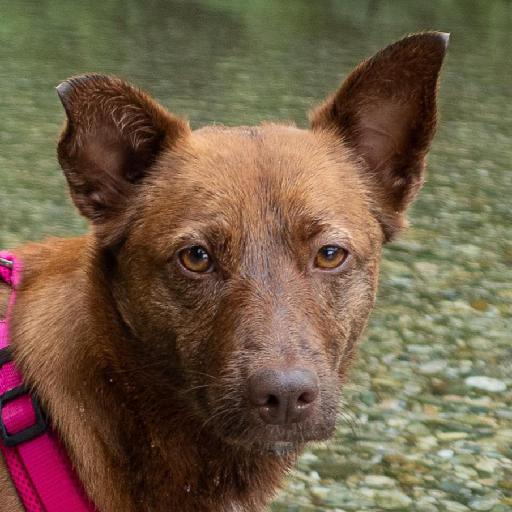
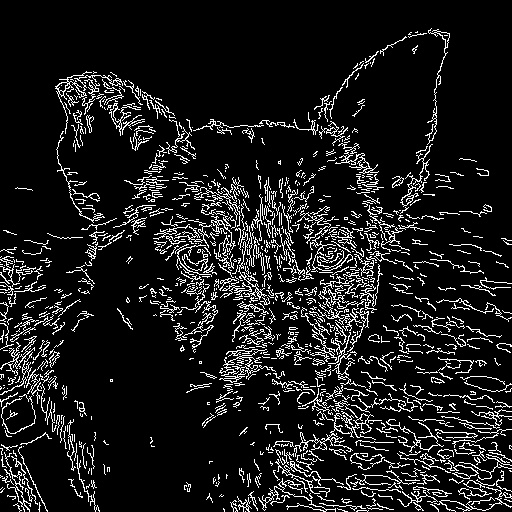

# B0. The Oxford-IIIT Pet Dataset - Augmented
- Image data are from https://github.com/clovaai/stargan-v2

# B1. Directory

```
+-- README.md
+-- assets
+-- afhq
        +
                +-- train
                    +-- cat
                    +-- dog
                    +-- wild
                +-- val
                    +-- cat
                    +-- dog
                    +-- wild                
        +-- date_edge
            +-- train
                +-- cat
                +-- dog
                +-- wild
            +-- val
                +-- cat
                +-- dog
                +-- wild   
        +-- date_grey
            +-- train
                +-- cat
                +-- dog
                +-- wild
            +-- val
                +-- cat
                +-- dog
                +-- wild   
        +-- date_part
            +-- train
                +-- cat
                +-- dog
                +-- wild
            +-- val
                +-- cat
                +-- dog
                +-- wild
        +-- date_txtr
            +-- train
                +-- cat
                +-- dog
                +-- wild
            +-- val
                +-- cat
                +-- dog
                +-- wild   
        +-- data_gen_afhq.py
        +-- README.md
+-- oxford
```

# B2. How To Use
## Download the Data
Execute Below

```
bash download.sh
```

## Then, Augment the Data
Execute Below

```
python data_gen.py
```

# B3. Aug methods
There are four augmentations. Detailed explanation and the name of function are shown. Code is in data_gen.py file.

## B3.0. original: 

 <br>

## B3.1. grey
  - func: to_grey() <br>
 <br>

## B3.2. edge
  - 모양부분을 스케치로 그리는 듯 edge를 뽑아냈다.
  - func: to_edge() <br>

 <br>

## B3.3. part
  - 눈 부분을 뽑았다. x(가로)방향으로는 xmin + 1/4h ~ xmax - 1/4h, y(세로)방향으로는 ymin + 5/12h ~ ymax - 5/12h를 추출하였다.
  - 기존 이미지의 (w, h)를 갖도록 resize하였다.
  - func: to_part() <br>

 <br>


## B3.4. txtr: Texture를 뽑는 과정
  - 태비(털모양) 부분을 뽑기 위해 극히 제한적인 box를 그려 texture를 뽑아냈다.
  - 기존 이미지의 (w, h)를 갖도록 resize하였다.
  - func: to_txtr()  <br>

! <br>

# References
Official: 
- https://github.com/clovaai/stargan-v2/
  