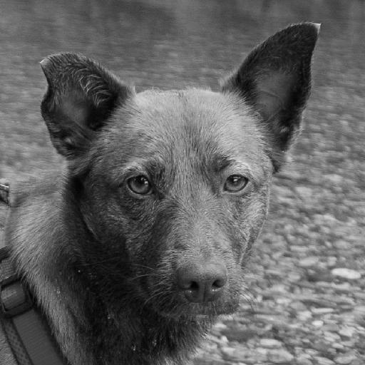

# B0. The Oxford-IIIT Pet Dataset - Augmented
- Image data are from https://github.com/clovaai/stargan-v2

# B1. Directory

```
+-- README.md
+-- assets
+-- afhq
        +
                +-- train
                    +-- cat
                    +-- dog
                    +-- wild
                +-- val
                    +-- cat
                    +-- dog
                    +-- wild                
        +-- date_edge
            +-- train
                +-- cat
                +-- dog
                +-- wild
            +-- val
                +-- cat
                +-- dog
                +-- wild   
        +-- date_grey
            +-- train
                +-- cat
                +-- dog
                +-- wild
            +-- val
                +-- cat
                +-- dog
                +-- wild   
        +-- data_txtr
            +-- train
                +-- cat
                +-- dog
                +-- wild
            +-- val
                +-- cat
                +-- dog
                +-- wild   
        
        +-- xml
            +-- train
            +-- val
                +-- cat_ear
                +-- cat_eye
                +-- cat_nose
                +-- cat_txtr
                +-- dog_ear
                +-- dog_eye
                +-- dog_nose
                +-- dog_txtr        
        +-- data_gen_afhq.py        
        +-- README.md
+-- oxford
```

# B2. How To Use
## Download the Data
Execute Below

```
bash download.sh
```

## Then, Augment the Data
Execute Below

```
python data_gen_afhq.py
```

# B3. Aug methods
There are four augmentations. Detailed explanation and the name of function are shown. Code is in data_gen.py file.

## B3.0. original: 

 <br>

## B3.1. grey 
  - func: to_grey() <br>
 
 <br>

## B3.2. edge
  - 모양부분 스케치 그리듯 edge
  - func: to_edge() <br>

 <br>

## B3.3. txtr
  - 동물의 피부 부분
  - func: to_txtr() <br>

 <br>

## B3.4. ear
  - 왼쪽 귀(왼쪽 추출 불가능 할 경우 오른쪽)
  - func: to_ear() <br>

 <br>

## B3.5. eye
  - 왼쪽 눈(왼쪽 추출 불가능 할 경우 오른쪽)
  - func: to_eye() <br>

 <br>

## B3.5. nose
  - 코
  - func: to_nose() <br>

 <br>


# References
Official: 
- https://github.com/clovaai/stargan-v2/
  